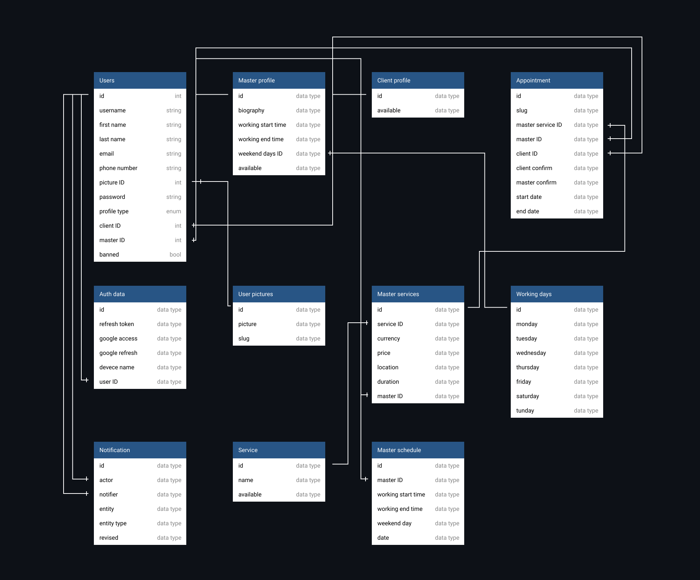

# Database structure

Table of contents:

- [Database structure](#database-structure)
  - [User](#user)
  - [User picture](#user-picture)
  - [Auth data](#auth-data)
  - [Client profile](#client-profile)
  - [Master profile](#master-profile)
  - [Service](#service)
  - [Master service](#master-service)
  - [Master weekends](#master-weekends)
  - [Master schedule](#master-schedule)
  - [Appointment](#appointment)
  - [Notification](#notification)

**Database structure:**

  

## User

The base user model that contain base user information.

References:

<!-- no toc -->
- [Auth data](#auth-data)
- [Client profile](#client-profile)
- [Master profile](#master-profile)
- [User picture](#user-picture)

## User picture

In the table stores user picture and user ID, which is reference to user to whom the image belongs.

## Auth data

The table stores user authentication information, for example access and refresh token, which required for JWT authentication. Also in the table stores google access and refresh tokens.

References:

<!-- no toc -->
- [User](#user)

## Client profile

The client profile has all users, masters and clients. It required to make an appointment.

## Master profile

The master profile has only a master, it is necessary to create an appointment.

In the table store, information about master, his working time, reference to `Master weekends` table. Also there are available column, if it's `false` any one can not make an appointment to the master.

References:

<!-- no toc -->
- [Master weekends](#master-weekends)

## Service

This is general services, when master create new master service, server check if service with described name exists in services table, if exists we do nothing with services table, otherwise create service with described name. In all de ways we make reference from master service to general service table.

## Master service

The table stores information about master service, for example price, currency, location, etc.

References:

<!-- no toc -->
- [Client profile](#client-profile)
- [Master profile](#master-profile)
- [Maser service](#master-service)

## Master weekends

The table stores seven days that represent days in week. For example if column monday has `true` value, the day is weekend. One master has one weekends, this weekends is general for master, but it can be redefined byt schedule table

## Master schedule

The table stores master schedule for day which described in `date` column.

Example:
In `Master weekends` table we master has weekends in saturday and sunday, but if he need to work in saturday, he can specify that he work in saturday in the table, and it rewrite all information about work day and master working time for specified `date`.

References:

<!-- no toc -->
- [Master profile](#master-profile)

## Appointment

The table stores information about appointment, master ID, client ID, etc.

References:

<!-- no toc -->
- [Client profile](#client-profile)
- [Master profile](#master-profile)
- [Maser service](#master-service)

## Notification

The table stores notification information. `Actor` column is a reference to use who triggered to notification, for example client. `Notifier` is a reference to user to whom the notification is intended. `Entity` helps to know what the notification is about. `Entity type` are the different types of notifications, for example create an appointment, delete, update etc.

References:

<!-- no toc -->
- [User](#user)
