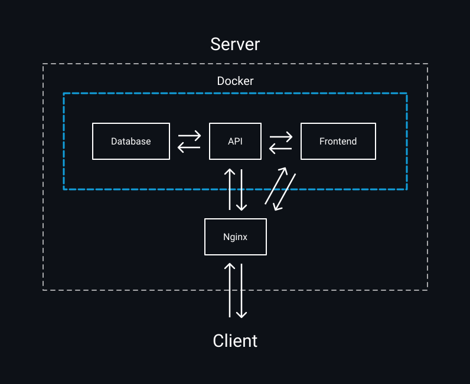

# Web services structure

  

Table of contents:

- [Web services structure](#web-services-structure)
  - [Server](#server)
  - [Docker](#docker)
  - [Database](#database)
  - [API](#api)
  - [Frontend](#frontend)
  - [Nginx](#nginx)
  - [Client](#client)

## Server

On server environment runs all the code and tools. We use VPS server, with [Linux Debian](https://www.debian.org/ "Debian official website") operating system.

## Docker

[Docker](https://www.docker.com/ "Docker official website") help use with deployment the website on server. We use docker-compose config to manage all the services.

## Database

As database we use [PostgreSQL](https://www.postgresql.org/ "PostgreSQL official website"). Here we store all the data.

## API

He is responsible for all business logic, for example create an appointment, register user, etc. API based on [Express.js](https://expressjs.com/ "Express.js official website") framework.

## Frontend

Frontend is a use interface. We use [React.js](https://reactjs.org/ "React.js official website") framework to create user interfaces, and [Next.js](https://nextjs.org/ "Next.js official website") for SSR and SSG.

## Nginx

[Nginx](https://docs.nginx.com/ "Nginx official website") we use as web server, to route all the requests from client to out services.

## Client

Client is a user who use out website.
